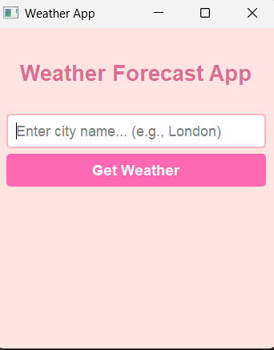

# Pink Weather App (PyQt5)

A simple, clean, and elegant desktop weather application built with Python using the **PyQt5** framework. This project connects to the **OpenWeatherMap API** to fetch real-time weather information globally.

## Features
* **Real-time Data:** Fetches instant temperature, humidity, and weather conditions.
* **Smart Input:** Automatically handles Turkish character issues and case sensitivity for safe API queries.
* **Cute UI:** Built with a clean and simple pink aesthetic designed using custom PyQt5 widgets.

## Preview


## How to Run
1. Clone or download this repository.
2. Install the required libraries:
   ```bash
   pip install PyQt5 requests